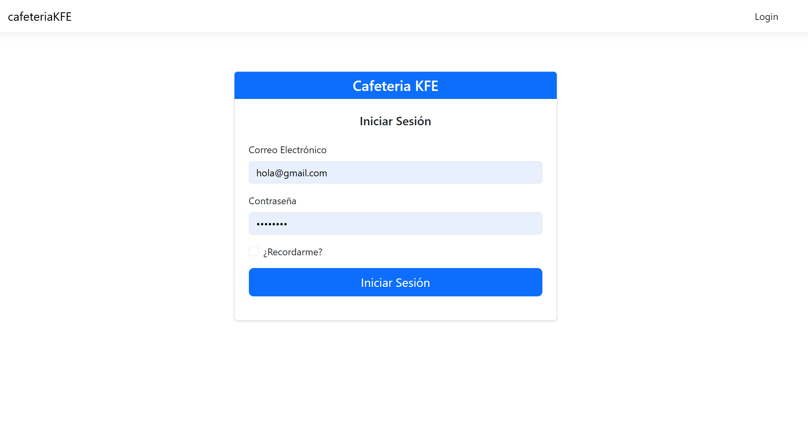
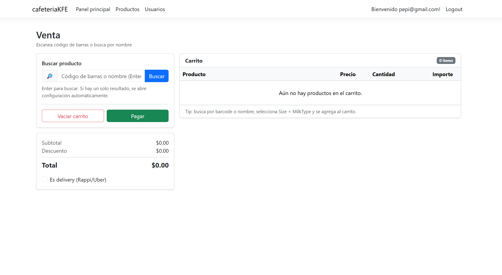
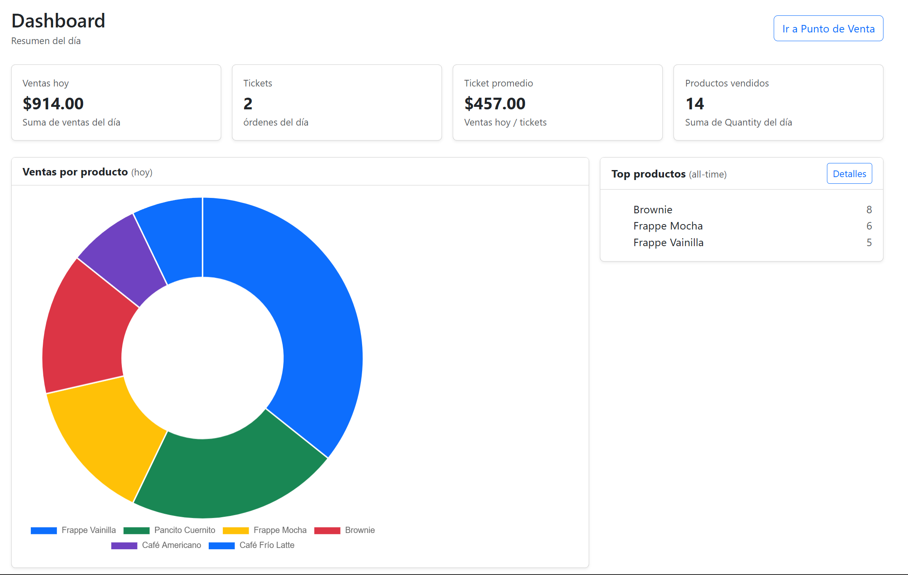
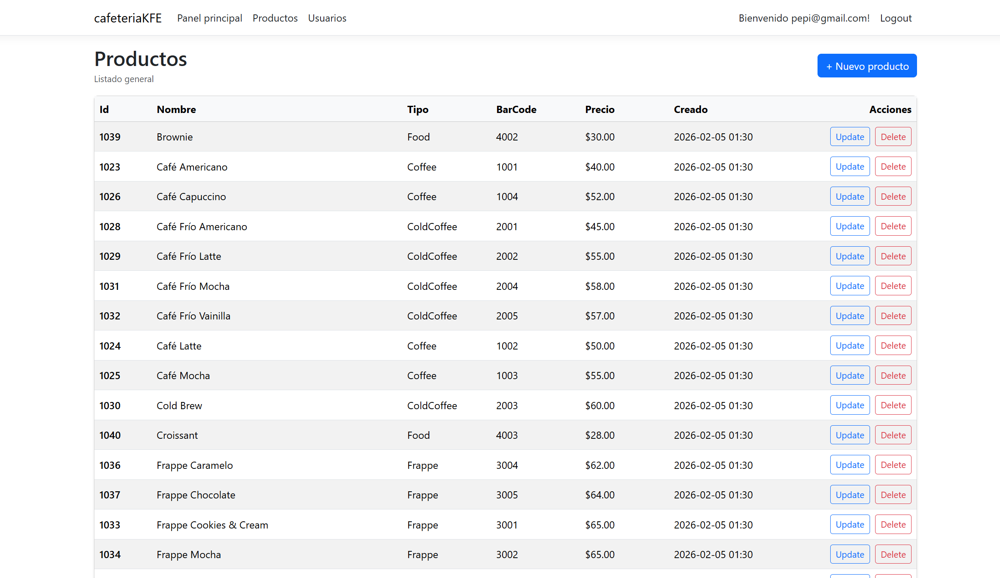

# Cafetería KFE - Sistema de Punto de Venta (POS)

## Resumen del Proyecto

Cafetería KFE es un sistema de Punto de Venta (POS) moderno y robusto diseñado específicamente para cafeterías. Desarrollado con ASP.NET Core MVC, esta aplicación proporciona una solución integral para la gestión de ventas, productos, usuarios y pedidos, asegurando una operación fluida y eficiente. El sistema se centra en una experiencia de usuario dinámica, autenticación segura y una arquitectura bien estructurada para su mantenibilidad y escalabilidad.

## Características

*   **Interfaz POS Dinámica**: Una interfaz de ventas intuitiva y basada en AJAX para una rápida toma de pedidos, búsqueda de productos y proceso de pago.
*   **Gestión Integral de Productos**:
    *   Crea, actualiza y gestiona productos con atributos detallados como categorías, tipos de leche, tamaños, jarabes y temperaturas.
    *   Soporte de códigos de barras para una identificación eficiente del producto.
*   **Autenticación y Autorización de Usuarios**: Gestión segura de usuarios utilizando ASP.NET Core Identity con control de acceso basado en roles (por ejemplo, Administrador, Cajero). La aplicación es segura por defecto, requiriendo inicio de sesión para la mayoría de las funcionalidades.
*   **Procesamiento de Pedidos**: Manejo eficiente de pedidos, incluyendo múltiples métodos de pago.
*   **Panel de Administración e Informes**: Un panel administrativo que proporciona información y capacidades de generación de informes, posiblemente utilizando visualizaciones de datos (por ejemplo, gráficos).
*   **Gestión de Base de Datos**: Utiliza Entity Framework Core para interacciones de base de datos y migraciones fluidas con SQL Server.
*   **Contenerización**: Listo para su despliegue utilizando Docker y Docker Compose para entornos consistentes.

## Tecnologías Utilizadas

### Backend
*   **Framework**: .NET 10.0
*   **Framework Web**: ASP.NET Core MVC
*   **Lenguaje**: C#
*   **ORM**: Entity Framework Core
*   **Base de Datos**: SQL Server
*   **Autenticación**: ASP.NET Core Identity

### Frontend
*   **HTML**: HTML5
*   **Framework CSS**: Bootstrap
*   **Librería JavaScript**: jQuery
*   **Client-side Validation**: jQuery Validation
*   **Librería de Gráficos**: Chart.js (para informes/panel)

## Arquitectura

El proyecto sigue un patrón arquitectónico limpio y en capas, promoviendo la separación de responsabilidades y la mantenibilidad:

*   **Controladores**: Manejan las solicitudes HTTP entrantes, procesan la entrada del usuario y devuelven las vistas o respuestas de API adecuadas.
*   **Servicios**: Encapsulan la lógica de negocio y orquestan las operaciones, interactuando con los repositorios.
*   **Repositorios**: Abstraen la lógica de acceso a datos, proporcionando una interfaz para interactuar con la base de datos (Entity Framework Core).
*   **Modelos**: Representan las entidades centrales y los objetos de negocio de la aplicación (por ejemplo, `Product`, `Order`, `User`).
*   **Core/DTOs**: Objetos de Transferencia de Datos utilizados para un intercambio de datos eficiente y seguro entre capas y puntos finales de API.

## Primeros Pasos

Sigue estas instrucciones para obtener una copia del proyecto y ponerlo en marcha en tu máquina local para desarrollo y pruebas.

### Prerrequisitos

*   [.NET SDK 10.0](https://dotnet.microsoft.com/download/dotnet/10.0)
*   [SQL Server](https://www.microsoft.com/en-us/sql-server/sql-server-downloads) (o una instancia compatible de SQL Server)
*   [Docker Desktop](https://www.docker.com/products/docker-desktop) (Opcional, para despliegue contenerizado)

### Configuración (Desarrollo Local)

1.  **Clona el repositorio:**
    ```bash
    git clone https://github.com/tu-usuario/cafeteriaKFE.git
    cd cafeteriaKFE/cafeteriaKFE
    ```
2.  **Actualiza la Cadena de Conexión a la Base de Datos:**
    Abre `appsettings.json` y `appsettings.Development.json` en la carpeta del proyecto `cafeteriaKFE` y actualiza la cadena de conexión `DefaultConnection` para que apunte a tu instancia de SQL Server.
    ```json
    {
      "ConnectionStrings": {
        "DefaultConnection": "Server=(localdb)\mssqllocaldb;Database=CafeteriaKFEDB;Trusted_Connection=True;MultipleActiveResultSets=true"
      },
      // ... otras configuraciones
    }
    ```
3.  **Aplica las Migraciones de Entity Framework Core:**
    Navega al directorio del proyecto `cafeteriaKFE` en tu terminal y ejecuta los siguientes comandos para crear y actualizar el esquema de la base de datos:
    ```bash
    dotnet ef database update
    ```
    *Si encuentras problemas, asegúrate de que tu cadena de conexión sea correcta y de que tienes la herramienta `dotnet ef` instalada (`dotnet tool install --global dotnet-ef`).*
4.  **Compila y Ejecuta la Aplicación:**
    ```bash
    dotnet build
    dotnet run
    ```
    La aplicación debería estar ahora en funcionamiento, normalmente en `https://localhost:7071` (o un puerto similar).

### Configuración (Docker)

1.  **Navega a la raíz del proyecto:**
    ```bash
    cd cafeteriaKFE/cafeteriaKFE
    ```
2.  **Construye la imagen de Docker:**
    ```bash
    docker build -t cafeteriakfe .
    ```
3.  **Ejecuta con Docker Compose:**
    En el directorio del proyecto `cafeteriaKFE` (donde se encuentra `docker-compose.yml`), ejecuta:
    ```bash
    docker-compose up -d
    ```
    Esto iniciará la aplicación y, potencialmente, un contenedor de SQL Server (dependiendo de tu configuración en `docker-compose.yml`).

## Uso

*   **Inicio de Sesión**: Accede a la página de inicio de sesión para autenticarte. Los roles de usuario predeterminados (por ejemplo, Administrador) pueden ser sembrados mediante migraciones o añadidos manualmente después de la configuración inicial.
*   **Interfaz POS**: Para los cajeros, la pantalla principal de "Venta" proporciona una interfaz dinámica para añadir productos a un pedido, aplicar personalizaciones y completar transacciones.
*   **Gestión de Productos**: Los administradores pueden acceder a secciones dedicadas para añadir nuevos productos, categorías y gestionar los detalles de los productos.
*   **Panel de Administración**: Proporciona una visión general de las ventas y otras métricas clave.

## Capturas de Pantalla

A continuación, te mostramos algunas vistas de la aplicación en funcionamiento:

### Página de Inicio de Sesión

*Interfaz de autenticación para acceder al sistema*

### Interfaz de Punto de Venta (POS)

*Pantalla principal para realizar ventas y gestionar pedidos*

### Panel de Administración

*Vista general con métricas y estadísticas del negocio*

### Gestión de Productos

*Administración de productos, categorías y precios*